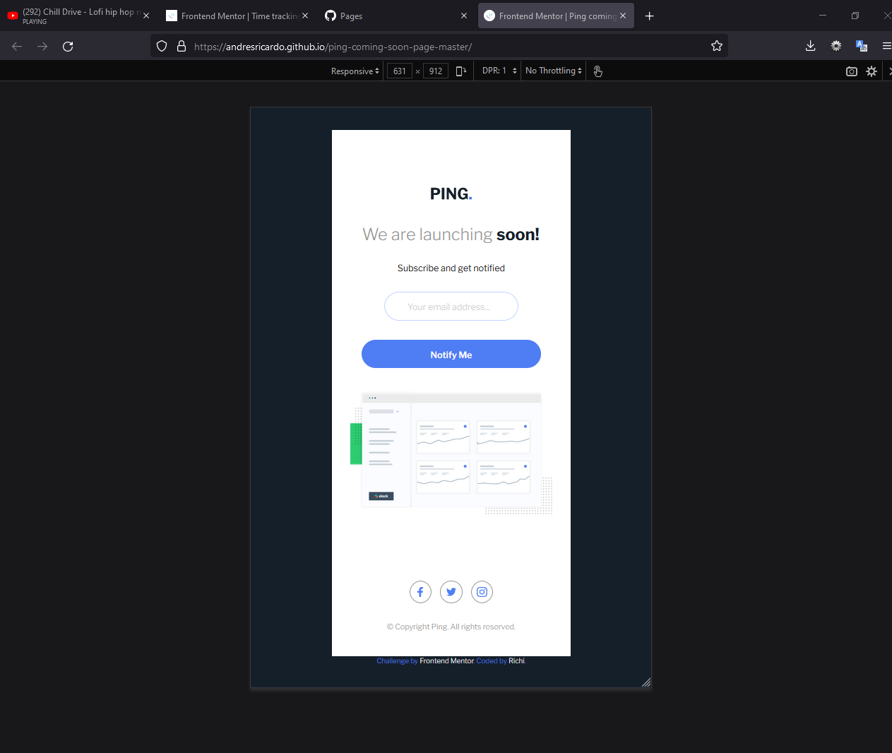
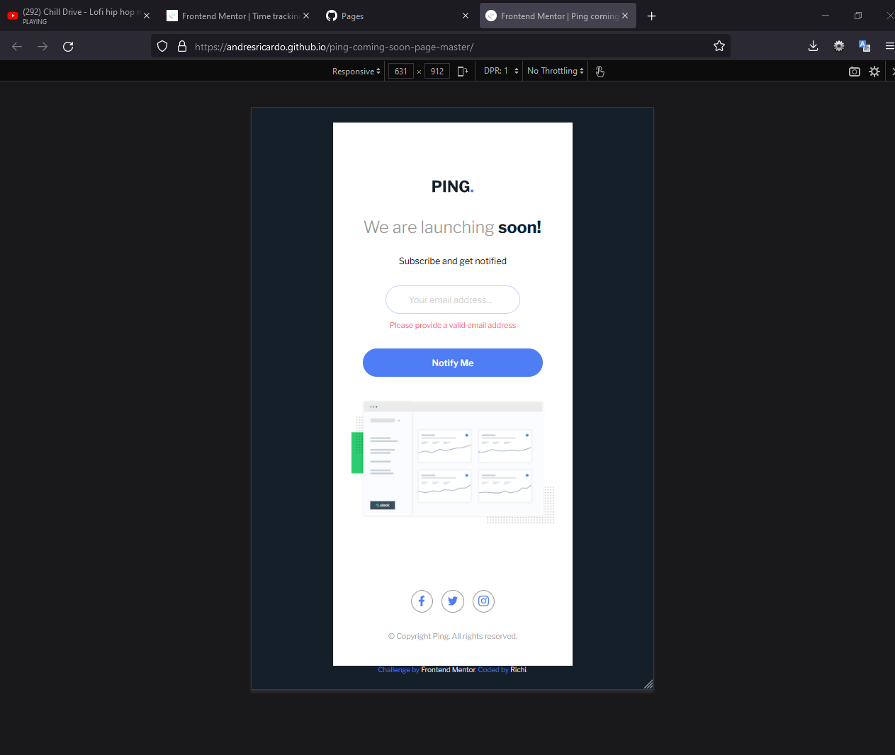
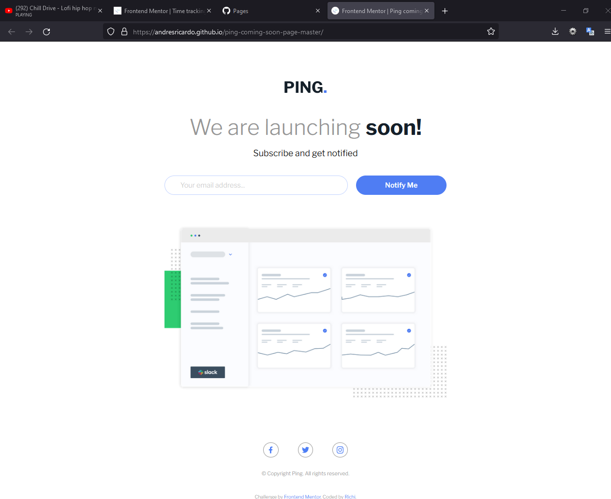
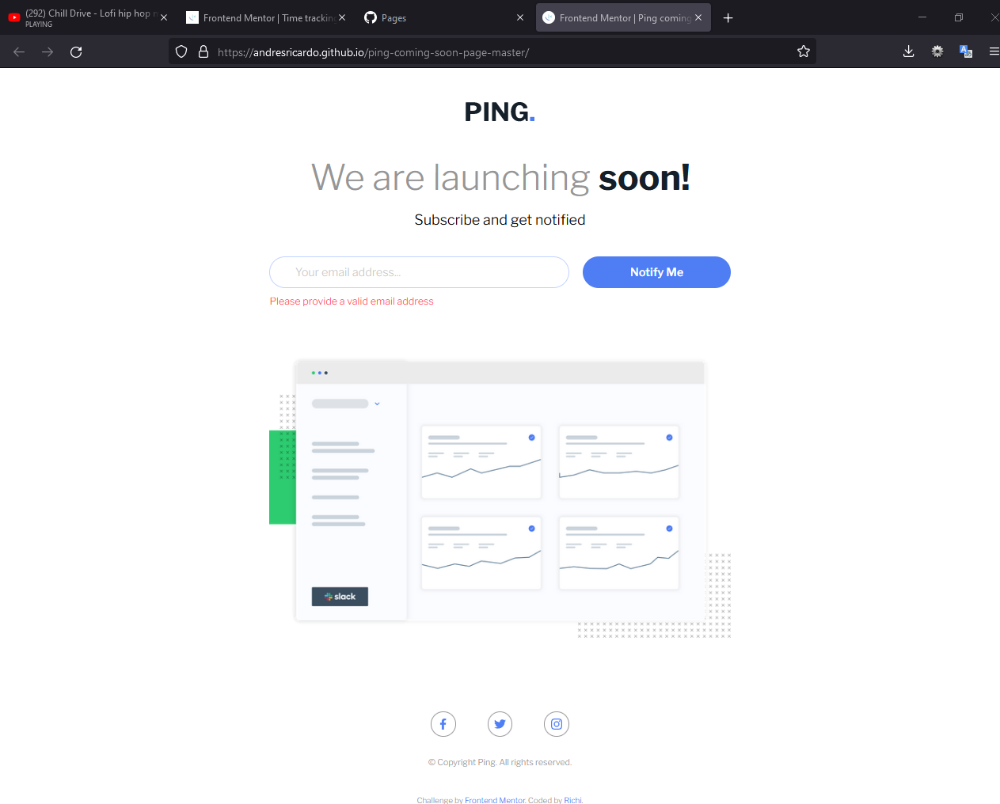

# Frontend Mentor - Ping coming soon page solution

This is a solution to the [Ping coming soon page challenge on Frontend Mentor](https://www.frontendmentor.io/challenges/ping-single-column-coming-soon-page-5cadd051fec04111f7b848da). Frontend Mentor challenges help you improve your coding skills by building realistic projects.

## Table of contents

-   [Overview](#overview)
    -   [The challenge](#the-challenge)
    -   [Screenshot](#screenshot)
    -   [Links](#links)
-   [My process](#my-process)
    -   [Built with](#built-with)
    -   [What I learned](#what-i-learned)
    -   [Continued development](#continued-development)
    -   [Useful resources](#useful-resources)
-   [Author](#author)
-   [Acknowledgments](#acknowledgments)

## Overview

This challenge was made using just HTML, CSS (SASS and Flexbox) and JavaScrip.

### The challenge

Users should be able to:

-   View the optimal layout for the app depending on their device's screen size
-   See hover states for all interactive elements on the page
-   See success or error message if email typed is ok or not

### Screenshot









### Links

-   Solution URL: [Github repository](https://github.com/AndresRicardo/ping-coming-soon-page-master)
-   Live Site URL: [Github page](https://andresricardo.github.io/ping-coming-soon-page-master/)

## My process

I'm just starting to learn web development, for now I only know some html, css (flexbox and grid included), sass and Javascript, basics of css framework bootstrap, no css post-processors, no Js frameworks, but i'm on the way.

### Built with

-   Semantic HTML5 markup
-   CSS custom properties
-   Css Flexbox
-   Css pre-processor sass
-   JavaScrip
-   Mobile-first workflow

### What I learned

doing this challenge i learned basics of DOM manage with JavaScritp and form validation with regular expretions

```javascript
const inputEmail = document.querySelector("#inputEmail");
const errorMsg = document.querySelector("#errorMsg");
const successMsg = document.querySelector("#successMsg");

const inputEmailId = "inputEmail";
const submitId = "submit";
const errorMsgId = "errorMsg";
const successMsgId = "successMsg";

const emailRegExp = new RegExp(
    "^[a-z0-9]+(.[_a-z0-9]+)*@[a-z0-9-]+(.[a-z0-9-]+)*(.[a-z]{2,15})$"
);

function showError() {
    errorMsg.style.display = "block";
    successMsg.style.display = "none";
}

function showSuccess() {
    errorMsg.style.display = "none";
    successMsg.style.display = "block";
}

document.addEventListener("click", (event) => {
    event.preventDefault();

    if (event.target.id === submitId) {
        if (!emailRegExp.test(inputEmail.value.toLowerCase())) {
            console.log("regexp nok");
            showError();
            return;
        }
        showSuccess();
        console.log("regexp ok");
    }
});
```

### Continued development

Even if to me is more complex design mobile first, i will continue develop of this way.
By now in short time, my next skills to develop are css post-processors (postcss), deeping in javascript, typescript and start with angular.

### Useful resources

-   [Developer mozilla](https://developer.mozilla.org/es/docs/Web/CSS/) - This helped me like general reference.

## Author

-   Website - [Richi](https://github.com/AndresRicardo)
-   Frontend Mentor - [@AndresRicardo](https://www.frontendmentor.io/profile/AndresRicardo)

## Acknowledgments

To my mom and dad jajajajja.
